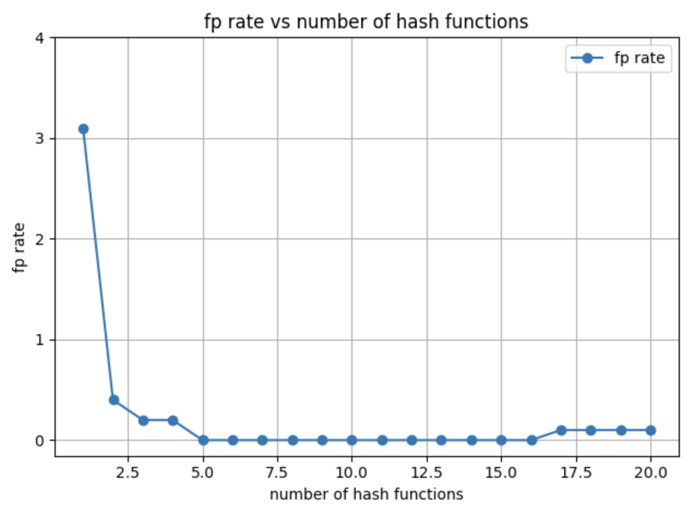

# Bloom Filters

This is the simple implementation of bloom filters in Go

## Installation

```
go get github.com/thisisnitish/bloom-filters
```

## Run the Project

```
go run main.go
```

## Behaviour

### Bloom Filter Size vs False Positive Rate

As you can see here, as the size increases of the bloom filters, the false positive rate
decreases. In short, lager the size of bloom filter, smaller the false positivity rate.

```
size:  100 fp_rate:  0.498 fp_rate_perc:  49.8
size:  1100 fp_rate:  0.183 fp_rate_perc:  18.3
size:  2100 fp_rate:  0.111 fp_rate_perc:  11.1
size:  3100 fp_rate:  0.089 fp_rate_perc:  8.9
size:  4100 fp_rate:  0.065 fp_rate_perc:  6.5
size:  5100 fp_rate:  0.038 fp_rate_perc:  3.8
size:  6100 fp_rate:  0.038 fp_rate_perc:  3.8
size:  7100 fp_rate:  0.035 fp_rate_perc:  3.5
size:  8100 fp_rate:  0.025 fp_rate_perc:  2.5
size:  9100 fp_rate:  0.024 fp_rate_perc:  2.4
size:  10100 fp_rate:  0.026 fp_rate_perc:  2.6
size:  11100 fp_rate:  0.027 fp_rate_perc:  2.7
size:  12100 fp_rate:  0.02 fp_rate_perc:  2
size:  13100 fp_rate:  0.02 fp_rate_perc:  2
size:  14100 fp_rate:  0.019 fp_rate_perc:  1.9
size:  15100 fp_rate:  0.015 fp_rate_perc:  1.5
size:  16100 fp_rate:  0.017 fp_rate_perc:  1.7
size:  17100 fp_rate:  0.02 fp_rate_perc:  2
size:  18100 fp_rate:  0.011 fp_rate_perc:  1.1
size:  19100 fp_rate:  0.013 fp_rate_perc:  1.3
size:  20100 fp_rate:  0.007 fp_rate_perc:  0.7
size:  21100 fp_rate:  0.011 fp_rate_perc:  1.1
size:  22100 fp_rate:  0.003 fp_rate_perc:  0.3
size:  23100 fp_rate:  0.011 fp_rate_perc:  1.1
size:  24100 fp_rate:  0.01 fp_rate_perc:  1
size:  25100 fp_rate:  0.01 fp_rate_perc:  1
size:  26100 fp_rate:  0.011 fp_rate_perc:  1.1
size:  27100 fp_rate:  0.012 fp_rate_perc:  1.2
size:  28100 fp_rate:  0.008 fp_rate_perc:  0.8
size:  29100 fp_rate:  0.005 fp_rate_perc:  0.5
```


### Space Optimisations

Here, we changed the bool array to byte array and used bitwise operation to set the bit and
check the bit.

### Number of Hash Functions vs False Positivity Rate

We checked the bloom filers with number of hash functions, say 20 hash functions on bloom filter
with size 10k. As you can see from the graph, as the number of hash functions increases, the
false postive have some value then it decreases to 0 and after sometime it increases.

Hence, having large number of hash functions is good but having too many hash functions will make your
program slower and after sometime you would see increase in false positivity rate.

```
number of hash functions:  1 fp_rate:  0.031 fp_rate_perc:  3.1
number of hash functions:  2 fp_rate:  0.004 fp_rate_perc:  0.4
number of hash functions:  3 fp_rate:  0.002 fp_rate_perc:  0.2
number of hash functions:  4 fp_rate:  0.002 fp_rate_perc:  0.2
number of hash functions:  5 fp_rate:  0 fp_rate_perc:  0
number of hash functions:  6 fp_rate:  0 fp_rate_perc:  0
number of hash functions:  7 fp_rate:  0 fp_rate_perc:  0
number of hash functions:  8 fp_rate:  0 fp_rate_perc:  0
number of hash functions:  9 fp_rate:  0 fp_rate_perc:  0
number of hash functions:  10 fp_rate:  0 fp_rate_perc:  0
number of hash functions:  11 fp_rate:  0 fp_rate_perc:  0
number of hash functions:  12 fp_rate:  0 fp_rate_perc:  0
number of hash functions:  13 fp_rate:  0 fp_rate_perc:  0
number of hash functions:  14 fp_rate:  0 fp_rate_perc:  0
number of hash functions:  15 fp_rate:  0 fp_rate_perc:  0
number of hash functions:  16 fp_rate:  0 fp_rate_perc:  0
number of hash functions:  17 fp_rate:  0.001 fp_rate_perc:  0.1
number of hash functions:  18 fp_rate:  0.001 fp_rate_perc:  0.1
number of hash functions:  19 fp_rate:  0.001 fp_rate_perc:  0.1
number of hash functions:  20 fp_rate:  0.001 fp_rate_perc:  0.1
```


